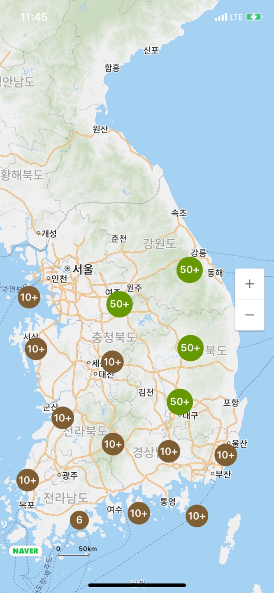
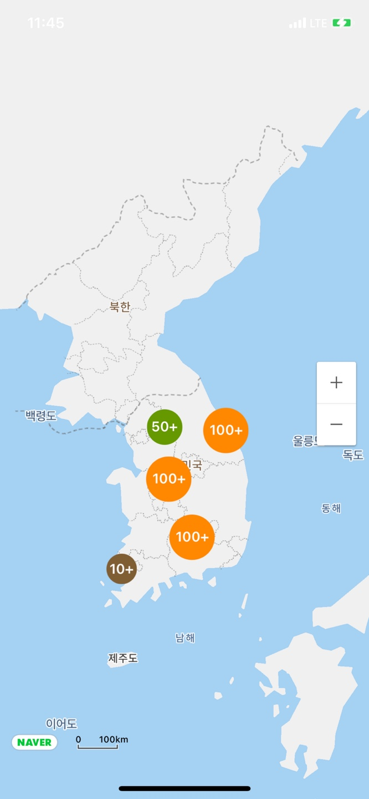
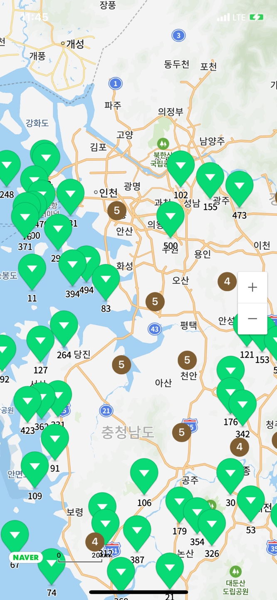

# NaverMapCluster

[](https://travis-ci.org/heomm123@naver.com/NaverMapCluster)
[](https://cocoapods.org/pods/NaverMapCluster)
[](https://cocoapods.org/pods/NaverMapCluster)
[](https://cocoapods.org/pods/NaverMapCluster)

## Description

네이버지도 API에서 클러스터링을 사용할수있는 라이브러리입니다.





## Example
예제는 해당 Repository의 Example폴더 내 예제 프로젝트 참고.

1. Framework 임포트
```
import NaverMapClusterFramework
```

2. ClusterManager 객체 생성
```
// ClusterManager 객체는 지도가 떠있는 동안 계속 사용되므로 가급적 전역변수로 사용.
let clusterManager: ClusterManager?
```

3. ClusterManager 객체 초기화
```
let naverMapView = NMFNaverMapView() // <- 네이버지도 API를 이용하여 생성한 지도 객체
clusterManager = ClusterManager.init(mapView: self.naverMapView) // 지도 객체를 ClusterManager의 init의 파라미터로 전달.
```

4. 마커정보 생성.
```
struct marker: markerProtocol { // markerProtocol을 상속받아 구조체 구현.
    var markerName: String = "" // 마커 이름
    var latitude: CGFloat = 0.0 // 위도
    var longitude: CGFloat = 0.0 // 경도
    
    var markerHandler: (() -> ())? // 마커를 터치했을때 동작 정의할 핸들러
}
```

5. 생성한 마커정보를 ClusterManager에 설정.
```
// 해당작업은 마커가 여러개일경우 여러개를 모두 add 해주면 된다.
// 자세한 내용은 Example의 generateClusterItems함수 참고.

let clusterItem = ClusterItem.init()

let position = CLLocationCoordinate2D(latitude: lat, longitude: lng) // lat: 위도 , lng: 경도

let markerInfo = marker.init(markerName: "\(idx)", latitude: lat, longitude: lng, markerHandler: { [weak self] in
        // 마커 클릭했을때의 동작 구현.
      })

clusterItem.markerInfo = markerInfo
clusterItem.position = position

clusterManager.add(clusterItem)
```

6. 클러스터 렌더링 진행.
```
clusterManager.cluster()
```

## Installation

NaverMapCluster is available through [CocoaPods](https://cocoapods.org). To install
it, simply add the following line to your Podfile:

```ruby
pod 'NaverMapCluster'
```

## Author

heogj123@gmail.com

## License

NaverMapCluster is available under the MIT license. See the LICENSE file for more info.
